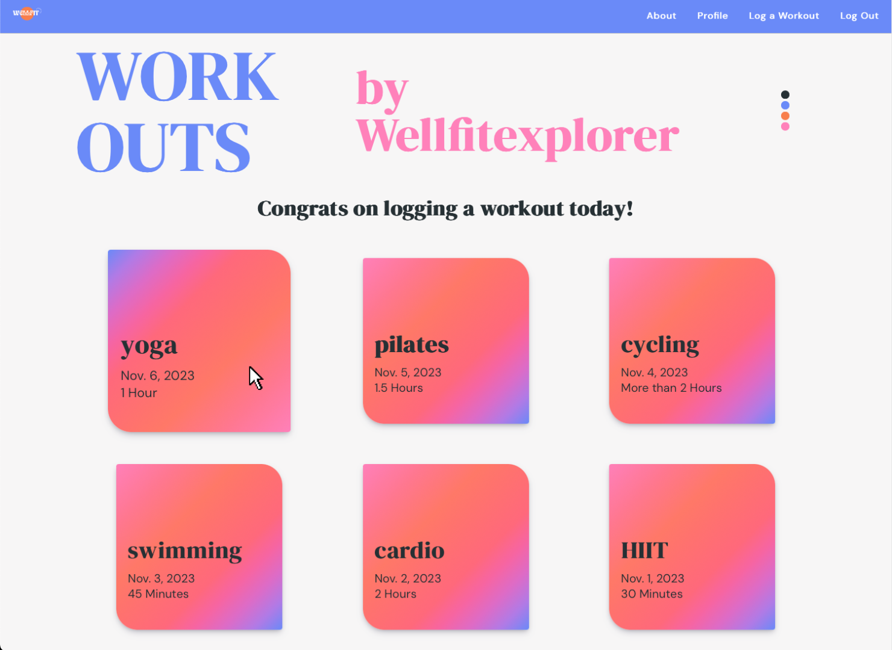

# WellFit - Your Online Workout Tracker

## Visit the WellFit website [HERE](https://wellfit.fly.dev/home/)
### Want to visit, but don't want to create your own profile? Use ours!
**Username:** WellFitExplorer

**Password:** WeFiEx786!

Note - *Please be respecful while browsing and creating content on our guest WellFitExplorer profile*

## Why WellFit?

Did you know that you are amost 50% more likely to achieve your goals if they are written down? And that tracking them regularly only brings that likelyhood up?

How many times have you made a fitness goal for yourself that you were unable to reach? Enter **WellFit**.

**WellFit** helps you achieve your goals by giving you a space to record your workouts, add notes on them and record movement sets, and let you know whether or not you've recorded a workout yet for the day!

#### Mobile-Responsive Design:

## Main App Features:
- **Log a Workout** to your profile that includes the type of workout, associated date, duration of the workout, and a description.

- **Add a Set** to your workout, in fact, add a few! These include a name, weight used, number of reps, and the equipment used.

- **Update and Delete** workouts, and delete your sets as well

- Get a **Conditionally Rendered Message** based on whether or not you've recorded a workout yet for the day

- **Completely Mobile Responsive Design** so that it looks good whether your are recording your latest workout on your laptop, tablet, or phone

- **Fun Card Animations** for workouts and sets

#### WellFit Profile Page:

#### Set Card Animation:

### Skills & Technologies Used ⚙️
- **Full-stack development** 
- **Full CRUD functionality** 
- **ERD design** 
- **Data entity management** 
- **CSS Flexbox** 
- **Django** 
- **Python** 
- **Neon Tech** 
- **Authentication** 
- **CSS Styling** 
- **Git Version Control** 

## Credits 🥳
 - **Canva** for stock images used in Home Page, and for wireframing

